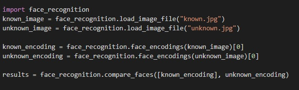
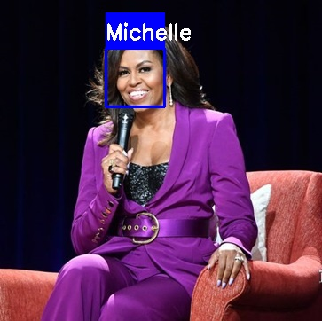
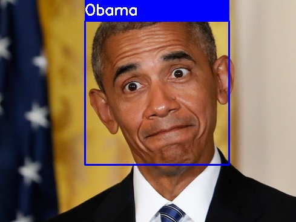
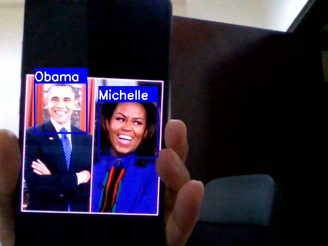

# FaceRecognition-face_recognition
## Introduction
  - This project uses face_recognition library to detect and recognize faces. This is the simplest face recognition library developed by Adam Geitgey. 
  - This library was built using dlib with deep learning. Dlib is a C++ toolkit which contains machine learning algorithms and other useful tools. 
  - With an accuracy of 99.38% it performs well in recognizing faces. The package also provides a command line tool which can be easily used to compare two images from a given path.
  -  A sample snippet of the code which uses face_recognition on two images, known.jpg and unknown.jpg:
    
  - Here the two images “known.jpg” and “unknown.jpg” are loaded into the two respective objects. Then the face_recognition module detects faces in the image and generates face    encodings. 
  ### Face Encodings
  - A face encoding is basically a way to represent the face using a set of 128 computer-generated measurements. Two different pictures of the same person would have similar encoding and two different people would have totally different encoding.
  - The results can be calculated by comparing and checking the similarity of known and unknown face encoding. 
## Setting up  
  - Make sure that you have python 3.6.6 installed on your local or on your virtual environment. However, a virtual environment is preferred.
  1.	pip install cmake
  2.	pip install dlib
  - if you have encountered any error while installing dlib, install dlib via the wheel file:\
  pip install https://pypi.python.org/packages/da/06/bd3e241c4eb0a662914b3b4875fc52dd176a9db0d4a2c915ac2ad8800e9e/dlib-19.7.0-cp36-cp36m-win_amd64.whl#md5=b7330a5b2d46420343fbed5df69e6a3f
  3.	pip install face_recognition
  4.  pip install opencv-python
## Face Recognizer in action
  - First, load all your images in the "faces" directory. Make sure that all the images are of similar sizes and there's 1 image each for every person.
  - Detecting faces from an image:\
  
  
  
  
  - Detecting faces from web cam:\
  
  - Happy coding! :)
